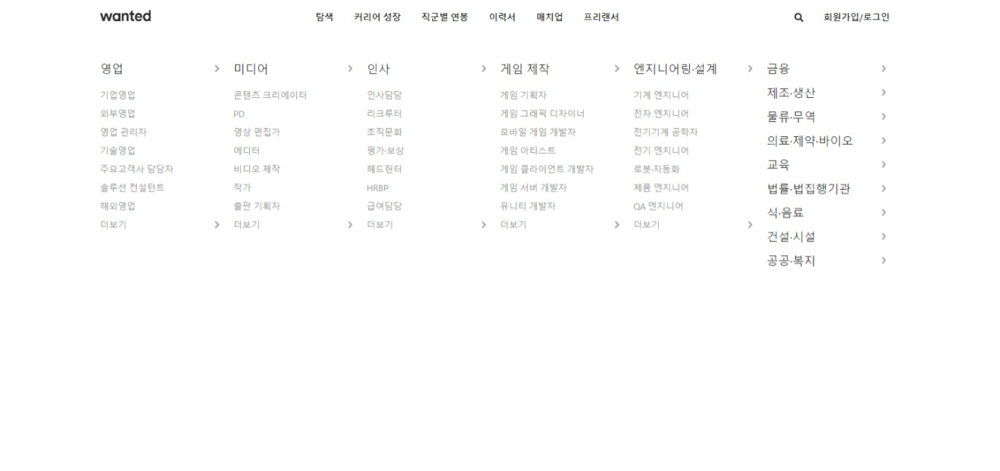

# 원티드 과제 - GNB(Global Navigation Bar) 클론

## 사용방법

```bash
npm install
npm start
# localhost:3000 확인
```

## 구현 내용

1. 반응형

   - 768px break point 이하에서는 원티드 사이트와 마찬가지로 메뉴 영역이 사라짐

2. 메뉴 정보
   - 우측에 대 카테고리가 나열된 2행 구현

## 라이브러리

1. fontawesome : icon 사용

## 스크린샷

1. PC



2. 모바일


